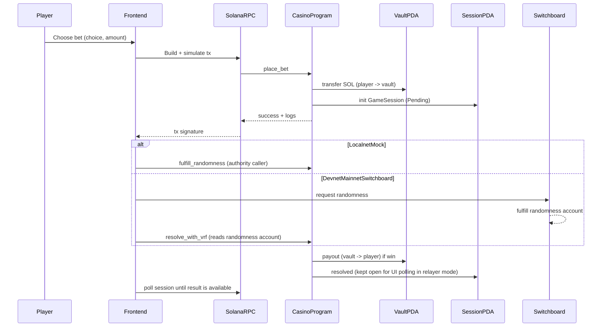

# ARCHITECTURE

**Purpose:** Canonical architecture + operational commands for the Solana multi-game casino (CoinFlip, Dice, Slots).  
**Last Updated:** 2025-12-31 (Documentation consolidation)  

**Devnet Program ID:** `CasytXe4cEiXJEcE3yZKxJtaHTDpZFkrVoe7ChJqY8ma`  
**Localnet Program ID:** `AUqeYqxd7bAtrvyu7icRVgfLBa8i5jiS9QiHx6WfUhpf`  

**Devnet upgrade authority (WSL keypair):** `/home/etabox/.config/solana/id.json`  
**Authority pubkey:** `DJthn6e42u3biESRCVnkjNB6AGFbh8fzCKPabb1caJTf`

---

## Canonical Pointers

This document contains the essential system architecture and operational commands. Related documentation:

- **Build/Deploy Steps**: See [BUILD_AND_DEPLOY.md](BUILD_AND_DEPLOY.md) for complete build instructions, Docker setup, and deployment workflows
- **Error History**: See [ERROR_HISTORY_AND_FIXES.md](ERROR_HISTORY_AND_FIXES.md) for known issues, fixes, and prevention strategies
- **Buyback System**: See [BUYBACK.md](BUYBACK.md) for complete buyback & burn system documentation
- **Archived Docs**: See `docs/archive/` for historical context and old implementation summaries

---

## System Overview

**What this is:**
- **On-chain program (Anchor/Rust)**: multi-game casino (CoinFlip, Dice, Slots) with shared treasury (Vault PDA), on-chain settlement, verifiable randomness
- **Frontend (React/Vite/TS)**: dark casino theme, game lobby, betting modals, real-time result display, session history, live leaderboard, audio system
- **Backend (Node/Express/TS)**: live leaderboard API, PostgreSQL + Redis, WebSocket broadcasts, game result webhooks, buyback service
- **Relayer (Node/TS)**: background service that auto-settles pending bets using casino authority keypair (devnet)

**Key product property:** **All funds movement is on-chain and verifiable** (bet, payout/refund, treasury balance).

---

## Program Structure

### Accounts & PDAs

**CasinoConfig** (PDA, singleton):
- `authority`, `vault_bump`, `treasury_bump`, `min_bet`, `max_bet`
- counters: `total_games`, `total_volume`, `total_payouts`, `total_treasury_skimmed`
- `is_active`, `switchboard_function` (optional)

**Vault** (PDA, SystemAccount):
- Holds SOL liquidity for all games
- Receives bets, pays winners via PDA signing
- Enforces worst-case liquidity checks per game
- Fixed reserve: 0.5 SOL (protected, never drained)

**TreasuryPDA** (SystemAccount):
- Holds excess profits earmarked for buyback & burn
- Rent-exempt minimum: ~0.00089 SOL
- Funded via `skim_excess_to_treasury` instruction

**GameSession** (PDA, per bet):
- `player`, `game_id`, `game_type` (CoinFlip | Dice | Slots), `bet_amount`, `choice`
- `status`: Pending | Resolved | Expired
- `randomness_request`, `result`, timestamps, `bump`
- Kept open after resolution so frontend can poll and display result

### PDA Seeds
```
Casino:   ["casino"]
Vault:    ["vault", casino_pda]
Treasury: ["treasury", casino_pda]
Session:  ["session", player_pubkey, game_id_le_bytes]
```

### Games & Payouts

**CoinFlip** (1.96x multiplier):
- Player chooses: 0 = heads, 1 = tails
- Random byte < 128 = heads, >= 128 = tails
- Win rate: ~48%
- Payout: bet × 1.96

**Dice** (5.0x multiplier):
- Player picks target number (2-12)
- Roll 2d6, sum result
- Exact match wins
- Win rate: ~2.78% (1/36)
- Payout: bet × 5.0

**Slots** (10.0x multiplier):
- Auto-spin 3 reels (0-9 each)
- 3-of-a-kind wins
- Win rate: ~10%
- Payout: bet × 10.0

---

## Instructions (currently deployed on devnet)

### `initialize(min_bet, max_bet, initial_vault_amount)`
Creates casino config + vault + treasury, transfers initial liquidity.

### `place_bet(game_type: GameType, choice: u8, bet_amount: u64)`
Atomic flow:
- Validates `game_type` (CoinFlip | Dice | Slots)
- Validates `choice` based on game: CoinFlip(0|1), Dice(2-12), Slots(any)
- Validates bet amount (min/max), player balance, vault liquidity for worst-case payout
- Increments `casino.total_games` (counter)
- Transfers SOL: player → vault
- Initializes GameSession PDA (Pending) with `game_type`
- Updates casino stats

**Liquidity rule (important):**
- On-chain checks **before** taking the bet: `vault_balance >= potential_payout`.
- Potential payout varies by game: CoinFlip(1.96x), Dice(5.0x), Slots(10.0x).
- If vault is too low, **bets are rejected** and UI shows "max bet 0".

### `fulfill_randomness(random_value: [u8; 32])`
Resolves the session based on `game_type`:
- **CoinFlip**: First byte < 128 = heads, else tails
- **Dice**: Two bytes → 2d6 roll (2-12)
- **Slots**: Three bytes → 3 reels (0-9 each), 3-of-a-kind wins
Pays out immediately if win. Session stays open for frontend polling.

### `skim_excess_to_treasury(amount: u64, min_vault_reserve: u64)`
Authority-only. Safely transfers excess SOL from Vault to Treasury while maintaining min reserve.

### `refund_expired()`
- Checks session pending + expired
- Refunds bet: vault → player
- Closes session

### `drain_vault(amount: u64)` (dev-only operator tool)
Authority-only. Transfers lamports from Vault PDA → authority wallet (used to "get SOL back" for testing).

**Expected side effect:** If you drain the vault close to 0, **betting will be blocked** until the vault is re-funded.

### Funding the Vault (liquidity)
The Vault PDA is a normal Solana address that can receive SOL transfers.
- **Operator action**: Transfer SOL from the authority wallet → Vault PDA to restore liquidity.
- Frontend provides an authority-only **"Operator: Fund Vault"** panel (simple SOL transfer) so you can recover from "max bet 0" immediately after draining.

---

## Randomness & Settlement Model

### Devnet (Relayer-Based Settlement)
- **Player**: Signs `place_bet` transaction only (no second popup)
- **Relayer**: Background script (`npm run relayer:devnet`) polls for pending sessions and calls `fulfill_randomness` using authority keypair
- **Frontend**: Polls session account to detect resolution and display result modal
- **Advantages**: Seamless UX, no gas for resolution, instant settlement
- **Trade-off**: Requires trusted relayer (acceptable for devnet/testing)

### Localnet (Mock VRF)
- Fast, deterministic
- Authority-gated `fulfill_randomness`

### Mainnet (Future: Switchboard VRF)
- Production-grade verifiable randomness
- `place_bet` → player triggers randomness request
- Switchboard fulfills randomness account
- Relayer or player calls `resolve_with_vrf` to settle
- Fallback: `refund_expired` if not resolved in time

---

## Transaction Flow



### Relayer mode (casino-like UX)
To avoid a second Phantom popup for "resolve fees", devnet testing uses an **authority relayer**:
- Player signs **only** `place_bet`.
- The authority bot calls `fulfill_randomness` to settle on-chain.
- Frontend **polls the session** and shows WIN/LOSS once `session.result` is present.

**Important:** We keep the session account open in this mode so the frontend can reliably fetch the result. (Rent refund/auto-close can be reintroduced later with a separate cleanup instruction.)

---

## Frontend Architecture

### Structure
```
app/src/
├── components/
│   ├── CasinoLobby.tsx        # Game selection screen with animated cards
│   ├── CoinFlip.tsx           # CoinFlip game + betting UI
│   ├── Dice.tsx               # Dice game + betting UI
│   ├── Slots.tsx              # Slots game + betting UI
│   ├── GameRoundModal.tsx     # Win/loss modal with money flow
│   ├── SessionList.tsx        # Session history + resolve/refund
│   ├── Leaderboard.tsx        # Live profit leaderboard (Socket.IO)
│   ├── CasinoInfo.tsx         # Operator stats + authority controls
│   ├── BuybackPanel.tsx       # Buyback & burn control panel (operator only)
│   ├── InitializeCasino.tsx   # Casino setup
│   └── WalletProvider.tsx     # Wallet adapter
├── games/
│   ├── coinflip/
│   │   └── CoinFlipView.tsx   # 3D coin animation + particle effects
│   ├── dice/
│   │   └── DiceView.tsx       # Dice roll animation
│   ├── slots/
│   │   ├── SlotsView.tsx      # Slot machine UI with spinning reels
│   │   ├── slotsSymbols.ts    # Symbol config, win conditions
│   │   └── useSlotsAudio.ts   # Audio hook for slots
│   └── common/
│       └── RoundStatus.tsx    # Reusable game status modal
├── audio/
│   └── audioManager.ts        # Singleton audio manager (Howler.js)
├── hooks/
│   ├── useCasino.ts           # Program/PDA/fetch logic
│   ├── useBet.ts              # Place bet logic (supports all 3 games)
│   ├── useFulfillRandomness.ts # Mock VRF (localnet)
│   ├── useClaimPayout.ts      # Claim winnings after resolution
│   ├── useLeaderboard.ts      # Report game results to backend
│   └── useVrfResolve.ts       # VRF resolve + refund
├── utils/
│   ├── constants.ts           # Program ID, network config
│   ├── errors.ts              # Error logging + user messages
│   ├── format.ts              # BN/lamports formatting
│   └── assets.ts              # Asset path helpers
├── index.css                  # Dark casino theme (CSS variables + utilities)
└── idl/casino.json            # Program interface definition
```

### UI Theme & Design System

**Dark Casino Theme** (`index.css`):
- CSS variables for colors: `--color-background`, `--color-primary` (gold), `--color-accent` (purple), text colors
- Utility classes:
  - `glass-effect`: Semi-transparent glass morphism with blur
  - `glow-effect`: Soft shadow/glow effects
  - `gradient-text`, `gradient-border`: Gold/purple gradients
- Animations: `float`, `pulse-glow`, `shake`, `slot-spin`, `dice-roll`, `confetti`, `jackpot`
- Tailwind extended with custom colors and keyframes

**Audio System** (`audio/audioManager.ts`):
- Singleton pattern using Howler.js
- User-gesture unlock for Web Audio API compliance
- Sound types: `ui_click`, `spin_loop`, `spin_stop`, `win_small`, `win_big`, `win_jackpot`, `coin_drop`
- Volume control with LocalStorage persistence
- Mute toggle with visual feedback
- Audio files expected in `app/public/assets/audio/`

**Game Components Architecture**:
- Each game has a main component (CoinFlip.tsx, Dice.tsx, Slots.tsx) with betting logic
- Separate View components (*View.tsx) handle animations and visual effects
- Shared RoundStatus modal handles all game result displays
- Audio integrated via audioManager singleton

### Backend Architecture (Leaderboard + Buyback)

**Structure**:
```
server/src/
├── index.ts                   # Express server entry point
├── database/
│   └── index.ts               # PostgreSQL setup + migrations
├── cache/
│   └── redis.ts               # Redis setup + leaderboard cache
├── services/
│   ├── leaderboardService.ts  # Leaderboard business logic
│   ├── buybackService.ts      # Buyback & burn automation
│   └── pumpPortalClient.ts    # Pump.fun API wrapper
├── routes/
│   ├── leaderboard.ts         # GET /api/leaderboard endpoints
│   ├── webhooks.ts            # POST /api/webhooks/game-result
│   ├── admin.ts               # Admin API (buyback control)
│   └── health.ts              # Health check
├── jobs/
│   └── cronJobs.ts            # Buyback scheduler
├── websocket/
│   └── index.ts               # Socket.IO setup + broadcasting
├── middleware/
│   └── errorHandler.ts        # Global error handler
└── utils/
    ├── logger.ts              # Winston logger
    ├── jupiter.ts             # Jupiter API wrapper
    └── tokenBurn.ts           # SPL token burn utility
```

**Database Schema** (PostgreSQL):
- `leaderboard_stats`: Aggregated player stats (wallet, net_profit, total_games, win_rate)
- `game_results`: Complete audit trail (tx_signature, wallet, game_type, bet, payout, is_win)
- `buyback_config`: Buyback system configuration
- `buyback_events`: Buyback transaction audit trail
- Tables created automatically on first run

**Caching Strategy** (Redis):
- Key: `leaderboard:top100`
- TTL: 30 seconds
- Invalidated on every game result
- Fast reads, low database load

**WebSocket Events** (Socket.IO):
- Client→Server: `subscribe:leaderboard`, `request:leaderboard`
- Server→Client: `leaderboard:update`, `leaderboard:data`
- Broadcasts to all subscribed clients on leaderboard changes

**API Endpoints**:
- `GET /api/leaderboard` - Top 100 players by net profit
- `GET /api/leaderboard/player/:wallet` - Individual player stats
- `POST /api/webhooks/game-result` - Record game result (auto-called by frontend)
- Buyback Admin Routes: See [BUYBACK.md](BUYBACK.md)

### Key Patterns

**BN/PublicKey Serialization (Critical):**
- Anchor returns `u64` as `BN` objects, keys as `PublicKey` objects
- React cannot render these directly → crashes
- **Solution**: serialize to strings immediately after fetching:
```typescript
  return sessions.map(s => ({
    publicKey: s.publicKey.toBase58(),
    account: {
      gameId: s.account.gameId.toString(),
      betAmount: s.account.betAmount.toString(),
      // etc...
    }
  }));
  ```
- Use `formatLamportsToSol()` for display, `BN` for calculations

**Legacy Account Handling (Schema Migrations):**
- **Problem**: Program upgrades that change account layout (e.g., adding `game_type` field) leave old accounts on-chain with incompatible layouts.
- **Symptom**: `program.account.gameSession.all()` hard-fails with errors like `Invalid bool: 5` when decoding legacy accounts.
- **Solution**: Use `connection.getProgramAccounts()` + per-account decode try/catch to **skip legacy accounts gracefully**:
```typescript
  const rawAccounts = await connection.getProgramAccounts(PROGRAM_ID, { filters: [...] });
  for (const { pubkey, account } of rawAccounts) {
    try {
      const decoded = program.coder.accounts.decode('gameSession', account.data);
      // ... use decoded
    } catch (decodeError) {
      // Skip legacy/incompatible account
    }
  }
```
- **Applies to**: Frontend session fetching, relayer polling, any bulk account reads after program upgrades

**Transaction Flow:**
- Build tx via Anchor `program.methods.*`
- Simulate first (fail fast)
- Send via wallet adapter
- Confirm with blockhash/lastValidBlockHeight

**Game Round UX (Casino Authority Mode):**
1. Place Bet → show "submitting" modal
2. Bet confirmed → show "flipping" animation
3. Auto-resolve (if authority) → fetch result
4. Show "result" modal with:
   - Win/Loss message
   - Coin outcome (heads/tails)
   - Money flow breakdown (paid, received, net)
   - Transaction links (bet + resolve)

---

## Security

### On-chain
- ✅ Atomic bet transfers (no escrow)
- ✅ Vault PDA signing (no private key)
- ✅ Liquidity checks (prevents insolvency)
- ✅ Input validation (choice, bet bounds, session state)
- ✅ Overflow-safe math (checked arithmetic)
- ✅ Access control (authority-gated admin functions)
- ✅ Treasury separation (buyback funds isolated)
- 🔄 VRF verification (Switchboard integration in progress)

### Frontend
- ✅ Official Solana wallet adapter (no key handling)
- ✅ Balance validation (prevents zero-balance bets)
- ✅ Transaction simulation (fail early)
- ⚠️ Public RPC (rate limited) → use private RPC for production

### Backend
- ✅ Buyback service with safety guardrails
- ✅ In-flight lock (prevents overlapping buybacks)
- ✅ Fixed vault reserve (0.5 SOL protected)
- ✅ Dual-mode execution (Pump.fun + Jupiter)
- ⚠️ Authority keypair in env (use KMS for production)

---

## Build / Upgrade / IDL Sync

This project was blocked by a real-world tooling mismatch:
- **Anchor 0.28** expects Solana tooling that still has `cargo-build-bpf`.
- Modern Solana/Agave installs ship `build-sbf` and remove `build-bpf`.

We fixed it by **using Solana CLI 1.18.21 for building/upgrading**, while keeping your normal Solana install intact.

### Toolchain that worked (WSL/Ubuntu)
- **Solana CLI for build/upgrade**: v1.18.21 (downloaded from GitHub releases)
- **Anchor CLI**: `anchor-cli 0.28.0`
- **Rust**: stable is fine for host tooling; Solana uses its own pinned toolchain for SBF

### Install Solana 1.18.21 (WSL)

```bash
mkdir -p ~/solana-install && cd ~/solana-install
curl -L -o solana.tar.bz2 \
  https://github.com/solana-labs/solana/releases/download/v1.18.21/solana-release-x86_64-unknown-linux-gnu.tar.bz2
tar -xjf solana.tar.bz2
```

### Build the program (WSL)
Use Solana 1.18.21 on PATH for this build:

```bash
export PATH=~/solana-install/solana-release/bin:/usr/local/sbin:/usr/local/bin:/usr/sbin:/usr/bin:/sbin:/bin:~/.cargo/bin
cd "/mnt/c/Users/Metabox/.cursor/casino solitaire - Copy (2)/casino-solitaire"

# Important: generate a Solana-compatible Cargo.lock for SBF builds
cd programs/casino
cargo +solana generate-lockfile
cd ../..

anchor build
```

### Upgrade the existing devnet program
We upgraded **the existing** devnet program `Casyt...` using buffer+upgrade commands:

```bash
export PATH=~/solana-install/solana-release/bin:/usr/local/sbin:/usr/local/bin:/usr/sbin:/usr/bin:/sbin:/bin:~/.cargo/bin
cd "/mnt/c/Users/Metabox/.cursor/casino solitaire - Copy (2)/casino-solitaire"

# 1) Write buffer
solana program write-buffer target/deploy/casino.so --output json
# -> {"buffer":"<BUFFER_PUBKEY>"}

# 2) Upgrade program
solana program upgrade <BUFFER_PUBKEY> CasytXe4cEiXJEcE3yZKxJtaHTDpZFkrVoe7ChJqY8ma \
  --upgrade-authority ~/.config/solana/id.json \
  --url https://api.devnet.solana.com
```

### Sync IDL to frontend (mandatory)

```bash
cp target/idl/casino.json app/src/idl/casino.json
```

If you skip this step, the UI will call missing instructions and you'll see "instruction not found / Custom:101".

### Prerequisites
- Rust 1.78+, Solana CLI 1.18.21, Anchor CLI 0.28.0, Node.js 18+

### Build & Deploy
```bash
# Build program (WSL/Linux)
anchor build

# Deploy to devnet
anchor deploy --provider.cluster devnet

# Copy IDL to frontend
cp target/idl/casino.json app/src/idl/casino.json

# Start frontend
cd app && npm install && npm run dev
```

### Program ID Sync
Ensure these match after deployment:
- `programs/casino/src/lib.rs` - `declare_id!(...)`
- `Anchor.toml` - `[programs.devnet]`
- `app/src/utils/constants.ts` - `PROGRAM_ID`
- IDL metadata address

### Current Deployments
- **Localnet:** `AUqeYqxd7bAtrvyu7icRVgfLBa8i5jiS9QiHx6WfUhpf`
- **Devnet:** `CasytXe4cEiXJEcE3yZKxJtaHTDpZFkrVoe7ChJqY8ma`

---

## Randomness (mainnet target)

**Current devnet state:** payout/resolution works (authority-driven `fulfill_randomness`), plus safety valves (`refund_expired`) and dev operator tools (`drain_vault`).  
**Mainnet plan:** integrate Switchboard VRF and resolve permissionlessly.

---

## Dependencies & Package Versions

### Frontend (`app/package.json`)
- `@coral-xyz/anchor`: `^0.28.0` (exact match with program)
- `@solana/wallet-adapter-react`: Latest
- `@solana/web3.js`: Latest
- `framer-motion`: Animation library for game effects
- `lucide-react`: Icon library
- `howler`: Audio management
- `socket.io-client`: WebSocket for leaderboard
- `react-hot-toast`: Toast notifications

### Backend (`server/package.json`)
- `express`: Web server
- `pg`: PostgreSQL client
- `redis`: Redis client
- `socket.io`: WebSocket server
- `winston`: Logging
- `zod`: Environment variable validation
- `axios`: HTTP client (Jupiter/Pump.fun APIs)

### Program Build Dependencies
- Rust: stable
- Solana CLI: 1.18.21 (for building with Anchor 0.28)
- Anchor CLI: 0.28.0

## Environment Configuration

### Frontend (`.env`)
```env
VITE_BACKEND_URL=http://localhost:3000
VITE_CASINO_PROGRAM_ID=CasytXe4cEiXJEcE3yZKxJtaHTDpZFkrVoe7ChJqY8ma
VITE_NETWORK=devnet
```

### Backend (`.env`)
```env
NODE_ENV=development
PORT=3000

# Database
DB_HOST=localhost
DB_PORT=5432
DB_NAME=casino_db
DB_USER=casino
DB_PASSWORD=casino_password
DB_SSL=false

# Redis
REDIS_HOST=localhost
REDIS_PORT=6379

# JWT (for future auth features)
JWT_SECRET=your_jwt_secret_key_at_least_32_chars_long
JWT_REFRESH_SECRET=your_jwt_refresh_secret_key_at_least_32_chars_long

# Solana
SOLANA_RPC_URL=https://api.devnet.solana.com
SOLANA_WS_URL=wss://api.devnet.solana.com/
SOLANA_NETWORK=devnet
CASINO_PROGRAM_ID=CasytXe4cEiXJEcE3yZKxJtaHTDpZFkrVoe7ChJqY8ma

# CORS
CORS_ORIGIN=http://localhost:5173

# Buyback (see BUYBACK.md for details)
AUTHORITY_PRIVATE_KEY=[123,45,67,...]  # Use KMS for production
```

## Docker Services

Backend requires PostgreSQL and Redis. Use Docker Compose:

**File: `server/docker-compose.yml`**
```yaml
version: '3.8'
services:
  redis:
    image: redis:7-alpine
    ports:
      - "6379:6379"
    volumes:
      - redis_data:/data
    restart: unless-stopped

  postgres:
    image: postgres:14-alpine
    environment:
      POSTGRES_DB: casino_db
      POSTGRES_USER: casino
      POSTGRES_PASSWORD: casino_password
    ports:
      - "5432:5432"
    volumes:
      - postgres_data:/var/lib/postgresql/data
    restart: unless-stopped

volumes:
  redis_data:
  postgres_data:
```

**Start services**:
```bash
cd casino-solitaire/server
docker-compose up -d
```

## Mainnet Readiness Checklist (high-level)

### On-Chain Program
- ✅ Atomic bet transfers and session lifecycle
- ✅ Multi-game support (CoinFlip, Dice, Slots)
- ✅ BN/PublicKey serialization (no React crashes)
- ✅ Expired session refunds
- ✅ Vault liquidity checks per game
- ✅ TreasuryPDA for buyback separation
- 🔄 Switchboard VRF integration (designed, not deployed)
- ❌ Security audit

### Frontend
- ✅ Dark casino theme with animations
- ✅ Game lobby with 3 playable games
- ✅ Audio system with user controls
- ✅ Friendly bet/payout UI
- ✅ Live leaderboard with WebSocket
- ✅ Buyback status panel (operator build)

### Backend
- ✅ Leaderboard API + WebSocket
- ✅ PostgreSQL + Redis setup
- ✅ Docker Compose for services
- ✅ Buyback service + cron job
- ❌ Helius/Shyft webhook integration (for mainnet indexing)
- ❌ Rate limiting + API authentication

### Operations
- ❌ Private RPC configuration
- ❌ Monitoring and alerts (Datadog/Sentry)
- ❌ Backup/recovery procedures
- ❌ Mainnet deployment runbook
- ❌ Incident response plan

---

**For detailed error history, see `ERROR_HISTORY_AND_FIXES.md`**  
**For build/deploy procedures, see `BUILD_AND_DEPLOY.md`**  
**For buyback system design, see `BUYBACK.md`**
